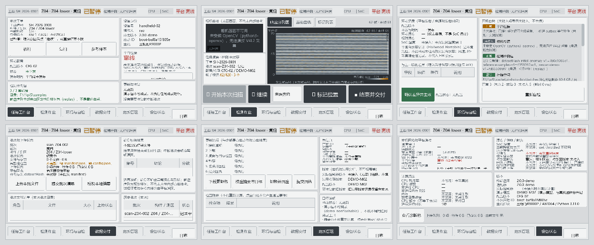

# 木脉智检 · 手持检测终端（Pi 5）

面向古建木构现场检测的手持终端程序。运行在**树莓派 Pi 5** 上，配约 **5 英寸 800×480 触摸屏**与 **720p 工业相机**，通过局域网与木脉智检平台联动。

> **先说清楚这台设备的边界**：本机**没有真实毫米波回波，也没有 IMU**。
> 程序不在这一点上做任何掩饰 —— 响应序列全部来自预制样例包并明确标注「检测样例」，
> 未接入的能力（IMU / 电池 / GPU）显示「未接入 + 原因」，不填 0、不填随机值。
> 而**连接、遥测、文件上传、摘要校验与命令回执全部真实运行**。

## 数据从哪来（这一页最重要）

| 数据 | 真实来源 | 界面上怎么标 |
|---|---|---|
| 相机画面 | V4L2 / picamera2 **实采** | 「相机实拍」；无相机时显示「相机未接入 + 原因」，不画占位假画面 |
| CPU / 内存 / 磁盘 / SoC 温度 / 降频 / 网卡速率 / 心跳延迟 | 本机**实测**（psutil、vcgencmd、sysfs、心跳往返） | 设备状态页逐项标注采集口径与来源 |
| 响应序列（俗称"回波"） | `samples/` 下的**固定检测样例包**（`response-sequence-v1`） | 「检测样例」；恒为 replay，不写成雷达实测帧率 |
| IMU / 姿态 / 电池 / GPU 利用率 | **未接入** | 「未接入 + 原因」，**不显示 0 或随机值** |
| 平台连接 / 文件上传 / 摘要校验 / 命令回执 | **真实** HTTP + WebSocket | 平台侧能查到同一份数据与同一个 `datasetHash` |

`telemetry.py` 这个文件里**没有任何随机数**（旧版曾用 `random` 生成 CPU、温度、相机 FPS）。

## 界面



*上排：任务工作台 / 检测作业（首屏）/ 环境与自检；下排：数据交付 / 更新管理 / 设备状态。*

800×480 触摸屏，灰银色工业主题，六个页面。尺寸按 PRD 定：顶部状态条 44px、主体 344px、底部操作条 68px，主按钮 64px、次级 48px。

| 页面 | 内容 |
|---|---|
| 任务工作台 | 设备身份、平台连接、本次工单、当前柱、待确认配置、下一项任务 |
| **检测作业**（首屏） | 左 240px 相机实拍 + 任务摘要；右 524px 响应序列图（可切当前曲线 / 标记列表）；底部「开始 / 暂停 / 标记位置 / 结束」三项大操作 |
| 环境与自检 | 平台下发的温湿度风速与**新旧差异**；逐项自检（未接入项显示未接入，**不全绿**） |
| 数据交付 | 文件数 / 字节数 / 完整性 / 上传状态 / 平台回执；端侧初筛结果 |
| 更新管理 | 接收 → 下载 → 摘要检查 → 切换演示模型版本 → 回验，各步显示真实细节 |
| 设备状态 | 真实遥测与连接分层：本机网络、平台服务、摄像头、样例播放器、控制器、上传队列 |

`docs/shots/` 里是六页的 800×480 原图；上面的概览图由
`python tools/make_contact_sheet.py` 生成（纯标准库拼图，不依赖 Pillow）。
快照本身由 `python tools/ui_shots.py --font <中文字体>` 渲染，
可以在没有实机的时候逐页核对布局。

## 快速开始

```bash
# 1) 依赖（树莓派；实机推荐 apt，不用 pip）
sudo apt install -y python3-pyqt5 python3-psutil python3-opencv fonts-noto-cjk

# 2) 部署预检：依赖、样例包、数据目录、平台可达性
python3 -m woodpulse --check

# 3) 运行（默认全屏 800×480）
python3 -m woodpulse
python3 -m woodpulse --no-fullscreen   # 开发机上开 800×480 窗口
python3 -m woodpulse --headless        # 没有屏幕时打印状态报告
```

**没有任何 pip 专有依赖**：WebSocket 客户端（RFC6455）、HTTP 客户端、SQLite 访问、日志轮转、PNG 生成全部用标准库实现。现场少一个装不上的依赖，就少一类故障。

### 没有真平台也能联调

仓库自带一个本地模拟平台（标准库实现，含 13 个设备接口、调试控制台与故障注入）：

```bash
# 终端 A：起模拟平台
python tools/mock_platform.py --port 8099 --data-dir .cache/mock-data --verbose

# 终端 B：把终端接上去并核对整条链路（27 项检查）
python tools/integration_check.py --platform-url http://127.0.0.1:8099
```

## 目录结构

```
woodpulse/                 终端程序（核心层不依赖 Qt，可在无图形环境跑验收）
  config.py                启动配置：默认值 → JSON → 环境变量 → 命令行
  contracts.py             消息与数据契约：信封、能力、来源标识、样例格式、事件类型
  app_state.py             任务/批次/配置/更新状态机（替代散落的布尔量）
  scenarios.py             三套样例包的登记表与剧本口径数值（0.71 / 0.84 / 0.87）
  telemetry.py             真实遥测与能力探测（本文件里没有随机数）
  storage.py               SQLite、批次目录、outbox、崩溃恢复、manifest 原子提交
  platform_client.py       HTTP + 手写 WebSocket + 心跳/重连退避/回执
  capture.py               采集编排：回放推进、人工标记、落盘、结果生成
  selfcheck.py             逐项自检（未接入项显示未接入，不全绿）
  update.py                演示模型包：下载、摘要校验、暂存、切换、回验
  app.py                   总装（GUI 只跟它说话）
  adapters/
    camera.py              V4L2 / picamera2 实采；无相机自动降级；等比缩放
    replay.py              固定样例包回放（本机唯一的"回波"来源）
  ui/                      PyQt5 灰银色 800×480 界面（12 个模块）
samples/                   三套固定检测样例包（response-sequence-v1）+ 说明
tools/                     样例包生成器、模拟平台、联调脚本、界面快照与概览图工具
tests/                     验收用例 H01–H16、关键事件拒收契约
docs/                      部署说明、平台接入教程、接口说明、模块说明、页面快照
```

## 一次检测作业的数据流

```
选择柱与测区 → 准备批次 ─┬─→ 开始 ─→ 每 100ms 推进样例回放 ─→ 追加一列响应序列
                        │                    │
                        │                    ├─→ 触屏「标记位置」：取当前相机截图 + 记录样例帧号
                        │                    │   （不暂停采集；方向可选，没选就不猜方位）
                        │                    │
                        │                    └─→ 达到适用域检查帧：冻结该批诊断输出
                        │
                        └─→ 平台请求暂停 ─→ 先停本地采集与回放 ─→ 再回 executed（带作用范围）
                                                    │
结束并交付 ─→ 写 segments/quality/result/marks ─→ 原子提交 manifest ─→ 允许上传
                                                    │
                                 分片 HTTP 上传（断点续传）→ 平台重算摘要 → 提交批次清单
```

终端的三个身份是分开的：`deviceId`（设备）、`operatorId`（操作人）、`demoSessionId`（排练轮次）。

## 已实测验证的事

| 验证 | 命令 | 结果 |
|---|---|---|
| 样例包可复现 | `python tools/make_samples.py --verify samples` | 3/3 通过；`--self-test` 确认两次生成字节完全一致 |
| 模拟平台自身 | `python tools/smoke_mock_platform.py` | 20/20 PASS |
| 终端 ↔ 平台真实联动 | `python tools/integration_check.py` | 27/27 PASS |
| 关键事件拒收契约 | `python tests/test_event_rejection.py` | 6/6 PASS |
| 验收用例 H01–H16 | `python tests/test_acceptance.py` | 51 项通过（2 项需 OpenCV） |
| 界面布局 | `python tools/ui_shots.py --font <中文字体>` | 6 页 800×480 渲染快照 |

`docs/模块说明.md` 第 4 节逐条记录了开发过程中**实测发现并修掉**的 7 个问题，
它们都属于"只有真跑起来才会暴露"的那一类：跨线程用 SQLite、关键事件只在重连时补传、
上传失败不退避（45 秒打了 572 次）、空摘要建单被拒、静默丢弃导致无限重推、
`--config` 被整份忽略、崩溃恢复低报帧数。

验收用例覆盖 PRD §13 的 H01–H16：遥测与系统工具对照、断网重连、相机拔出重插、
能力不夸大、暂停冻结序列、同一样例两轮同结果、标记不推方位、旧批次/过期命令拒执、
配置持久化、断点续传、更新包三种情况、点击空白不产生虚构事件、采集中暂存更新、
崩溃恢复、两端结果一致、触控布局。

### 关键事件通道的契约

平台回 `/api/device-events/batch` 时，`accepted` / `duplicated` 是 **messageId 数组**（不是计数）；
`rejected` 每条带 `messageId`、`reason`、`code`、`retryable`；
**平台必须保证每个收到的 messageId 最终进 `accepted` 或 `rejected` 之一，不得静默丢弃**。

| 平台回执 | 终端行为 |
|---|---|
| `accepted` / `duplicated` | 从 outbox 出队 |
| `rejected` + `retryable=false` | **出队，不再重试**（未知类型、版本不符、deviceId 不符…） |
| `rejected` + `retryable=true`（或缺省） | 保留，按退避重试（平台过载、队列满…） |
| 什么都没回 | 保留并重试，连续多轮后打一条指向契约的告警 |

缺省按「临时失败」处理是刻意的保守选择：宁可多试几次，也不因为平台漏写一个字段就丢业务数据。

## 文档

| 文档 | 给谁看 |
|---|---|
| [`docs/部署说明.md`](docs/部署说明.md) | 要在树莓派上装起来的人：apt 依赖、配置、触摸屏/X、systemd 自启、现场验收清单、故障排查 |
| [`docs/平台接入教程.md`](docs/平台接入教程.md) | 要把终端接到自己平台的人：握手时序、Express 落点示例、22 条常见坑 |
| [`docs/平台接口说明.md`](docs/平台接口说明.md) | 要对着字段写代码的人：逐接口字段/错误码/幂等规则表 |
| [`docs/模块说明.md`](docs/模块说明.md) | 要改这个程序的人：模块职责、设计取舍、踩过的 7 个坑、改功能时该动哪里 |
| [`samples/README.md`](samples/README.md) | 要替换检测样例的人：包结构、`datasetHash` 算法、命名规则 |

## 口径约定

这些不只是注释，测试里也有断言：

- 单位统一：百分比 0–100、字节、秒或毫秒、摄氏度。UI 层才换算 KB/s 与 MB/s。
- 不可用字段一律 `null` + `reason`；`0` 只表示有效的零值。
- 网卡收发速率是**接口流量**，不是本应用上传速率，两者在设备状态页分栏显示。
- 历史欠压标志与当前欠压标志分开显示，不把"历史上发生过"渲染成"现在正在欠压"。
- SoC 温度 ≠ 木材周围环境温度；环境温度只来自平台仪表记录。
- 平衡含水率（Hailwood-Horrobin）是环境先验，明确写"不能当成木柱内部实测含水率"。
- 响应序列的纵轴是采样点／频点索引，**未标定距离轴时不写成内部深度毫米值**；
  端侧不输出异常深度与形状。
- `accepted` 只表示命令已接收；`executed` 必须由真正完成动作的地方回；
  `failed` 带错误码与原因。暂停类回执必须写明作用范围。
- 结束采集 ≠ 上传完成 ≠ 平台分析完成：交付页三条状态独立显示。
- 更新只切换**本地演示模型版本**，不改真实 ESP32 固件版本字段，不调用任何烧录工具；
  摘要通过只可能来自本机重新计算。

## 依赖

| 依赖 | 缺失后果 |
|---|---|
| Python 3.9+ | 必需 |
| PyQt5（或 PySide6） | 无法起界面；`--headless` 仍可运行并打印状态 |
| psutil | CPU / 内存 / 网卡计数改为 `/proc` 降级读取，读不到的字段标「不可用 + 原因」 |
| OpenCV | 相机能力声明为「未接入」；样例回放、遥测、上传、回执全部照常工作 |

`ui/qt.py` 是 PyQt5 / PySide6 兼容层，同一份界面代码两边都能跑；
也支持完全没有 Qt 的环境（核心层不 import Qt）。

## 许可

见 [LICENSE](LICENSE)。
